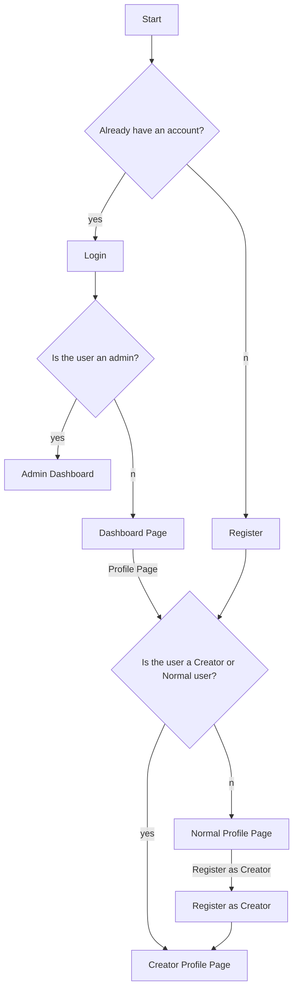

```mermaid
flowchart TD
    dashboard[Dashboard Page]
    alreadyHaveAccount{Already have an account?}
    login[Login]
    signup[Register]
    registerAsCreator[Register as Creator]
    isAdmin{Is the user an admin?}
    isCreatorOrNormal{Is the user a Creator or Normal user?}
    adminDashboard[Admin Dashboard]
    creatorProfilePage[Creator Profile Page]
    normalProfilePage[Normal Profile Page]
  Start --> alreadyHaveAccount --yes--> login
  alreadyHaveAccount --no--> signup --> isCreatorOrNormal
  login --> isAdmin --yes--> adminDashboard
  isAdmin --no--> dashboard -- Profile Page --> isCreatorOrNormal --yes--> creatorProfilePage
  isCreatorOrNormal --no--> normalProfilePage -- Register as Creator --> registerAsCreator --> creatorProfilePage

```